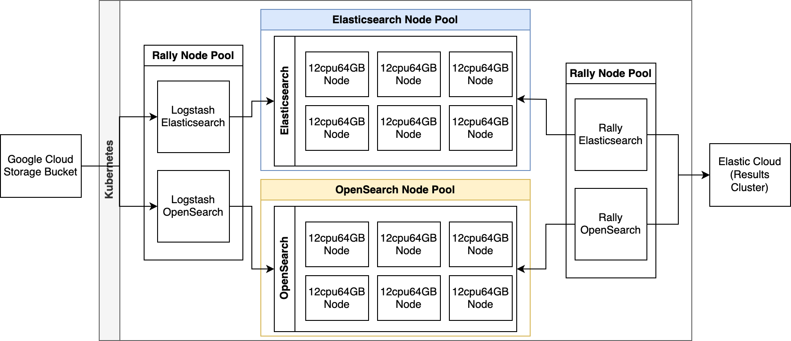
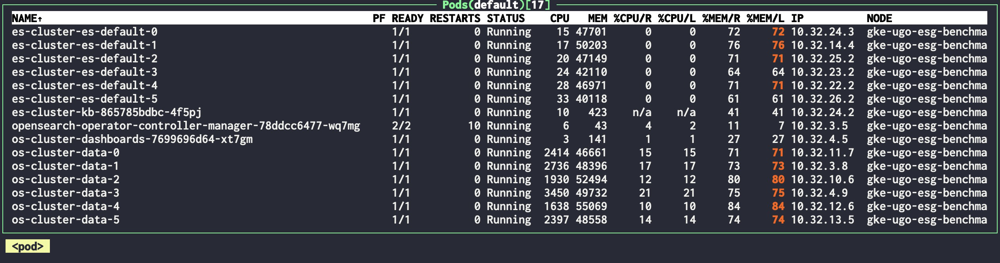
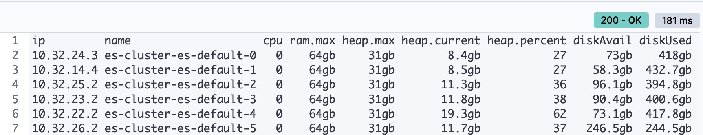
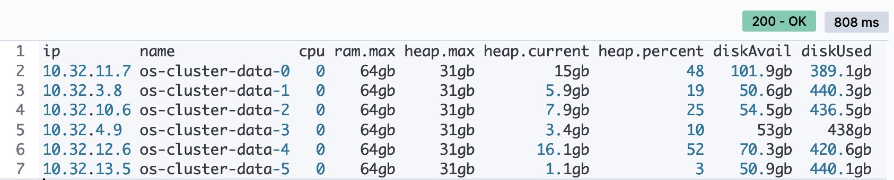
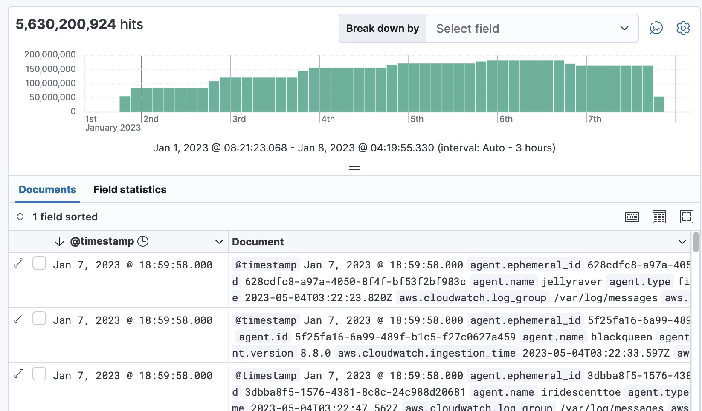
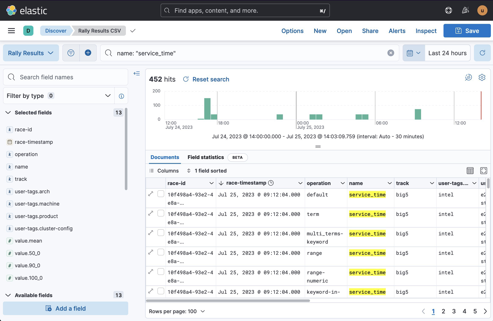
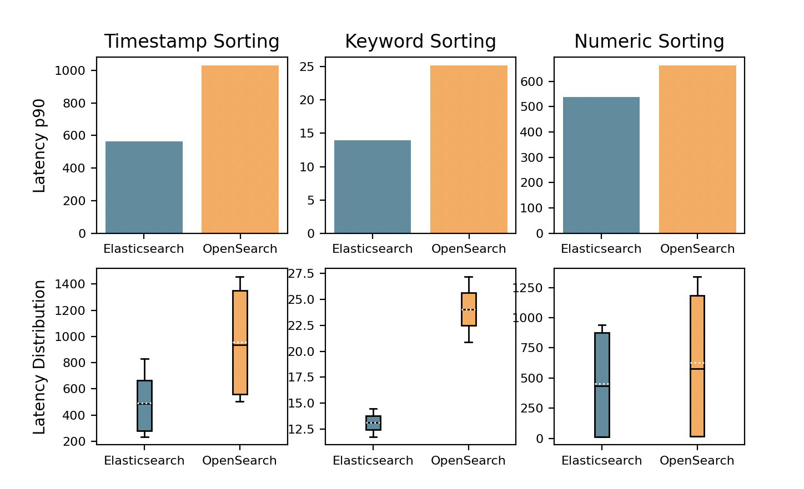

# Elasticsearch vs OpenSearch

## 1 - Provisioning the infrastructure




Use [this terraform script](./terraform/main.tf) to provision a Kubernetes cluster with:
- 1 Node pool for Elasticsearch with 6 `e2-standard-32` machines (128GB RAM and 32 CPUs)
- 1 Node pool for OpenSearch with 6 `e2-standard-32` machines (128GB RAM and 32 CPUs)
- 1 Node pool for Rally with 2 `t2a-standard-16` machines (64GB RAM and 16 CPUs)


## Creating Elasticsearch and Opensearch clusters

### Install ECK

```bash
kubectl create -f https://download.elastic.co/downloads/eck/2.6.1/crds.yaml
kubectl apply -f https://download.elastic.co/downloads/eck/2.6.1/operator.yaml
```

Deploy the Elasticsearch Kubernetes Manifest [here](./k8s/elasticsearch-cluster.yml)

```bash
kubectl apply -f k8s/elasticsearch-cluster.yml
```

Get the elastic username and password with:

```c
kubectl get secret es-cluster-es-elastic-user -o "jsonpath={.data.elastic}" | base64 -d; echo
```

Open up the Kibana port and access it under http://localhost:5601

```c
 kubectl port-forward service/es-cluster-kb-http 9243:5601
```

#### Configure and create the datastream

Go to [this section](./datastreams/elasticsearch.md) and copy and paste to a Kibana Dev tools.

### Install OpenSearch Kubernetes Operator
```bash
helm repo add opensearch-operator https://opster.github.io/opensearch-k8s-operator/
helm install opensearch-operator opensearch-operator/opensearch-operator
```

Deploy the OpenSearch Kubernetes Manifest [here](./k8s/opensearch-cluster.yml)

```bash
kubectl apply -f k8s/opensearch-cluster.yml
```

Open up the Dashboards port and access it under http://localhost:5601

```c
  kubectl port-forward service/opensearch-dashboards-service 5601:5601
```

Default username in OpenSearch is `admin` with password `admin`

#### Configure and create the datastream

Go to [this section](./datastreams/opensearch.md) and copy and paste to a Dashboards Dev tools.


## Verifying 

Your Kubernetes cluster should look something like below, with 6 nodes for Elasticsearch and 6 for OpenSearch.

<kbd></kbd>

We can use the _cat nodes API to quickly inspect we have both solutions under the same conditions, run the following in Dev Tools:

```js
GET _cat/nodes?v&h=ip,name,cpu,ram.max,heap.max,heap.current,heap.percent,diskAvail,diskUsed&s=name
```

Elasticsearch should show `ram.max` as 64gb and `heap.max` as 31gb:

<kbd></kbd>

Similarly OpenSearch:

<kbd></kbd>


## 2 - Generating the dataset

The [generate.sh](./dataset/generate.sh) script generates a dataset using the [elastic integration corpus generator tool](https://github.com/elastic/), creating 1024 files with each file's size set to 1GB. The generator uses a template file and a YAML configuration file for content generation. The resulting files are converted to .ndjson format, gzipped, and then uploaded to a specified Google Cloud Storage bucket using gsutil cp. Each file is uploaded to the bucket, and the script removes the local gzipped files afterward. 

To run the script, the following dependencies are required:
  - `elastic-integration-corpus-generator-tool`: the script should point to the correct full path of this tool using the GENERATOR variable. The binaries of the elastic integration corpus generator tool are also provided in the repository for ARM and Intel architectures, in the `dataset/bin` folder.
  - `gsutil`: the command-line tool provided by Google Cloud SDK for interacting with Google Cloud Storage. 
  - `gzip`: This is a standard Unix tool used for file compression and decompression. It is used in the script to gzip the generated files before uploading them to the bucket.

example: 
```bash
# Full path to elastic-integration-corpus-generator-tool binary tool
export GENERATOR=/full/path/to/elastic-integration-corpus-generator-tool-arm
# Where the dataset should be written
export CORPORA_ROOT=/full/path/to/dataset/generated
export CONFIG=config-1.yml
export BUCKET=gs://my-gcp-bucket/2023-01-01/
```


## 3 - Ingesting the dataset

Now that our data is in a Google Cloud Storage bucket, we will use the `google-cloud-storage` input plugin for Logstash, and we are also going to need the `logstash-output-opensearch` to send data to OpenSearch. Those two plugins dont come installed by default in Logstash, luckly this can be easily fixed with a custom Docker image, for which a [Dockerfile](./logstash-custom/Dockerfile) is provided.

Let's build our custom Logstash image using the Makefile in `logstash-custom/Makefile`, the image is multi-arch so it will work on both ARM and Intel machines, you just need to change the `$TAG` variable to match your docker username, the makefile will use docker buildx to build the image and push to the repository.

```makefile
TAG := ugosan/logstash-custom:8.8.2-dev

ARM_TAG := $(TAG)-manifest-arm64v8
AMD_TAG := $(TAG)-manifest-amd64

all: build push pull

build:
	@echo "\n::: Building $(ARM_TAG)"
	docker buildx build --push -f Dockerfile --platform linux/arm64/v8 --tag $(ARM_TAG) .
	@echo "\n::: Building $(AMD_TAG)"
	docker buildx build --push -f Dockerfile --platform linux/amd64 --tag $(AMD_TAG) .
	docker manifest create $(TAG) --amend $(ARM_TAG) --amend $(AMD_TAG)
	@echo "\n::: Building done!"

push:
	docker manifest push $(TAG) --purge

pull:
	docker pull $(TAG)
```

Just run `make` in `logstash-custom` and you will be good to go.

Now lets use Logstash to index the data from GCS to Elasticsearch and OpenSearch, for which two Kubernetes manifests are provided: `logstash-es.yml` and `logstash-os.yml`, but before you run them, make sure you included your `credentials.json` from GCP into `logstash-gcp-credentials.yml`.

Get a base64 encoded version of your `credentials.json` and add it to `logstash-gcp-credentials.yml` then apply it:

```
kubectl apply -f logstash-gcp-credentials.yml
```

The Logstash Pods must be allocated to a separate nodepool from Elasticsearch and OpenSearch ones, for which we will be using the `rally-nodes` nodepool we have configured in terraform. We also specify the `image` we have just made and the `GCP_FILE_MATCH_REGEX` to fetch the `*.ndjson.gz` dataset files. 

```yml
apiVersion: v1
kind: Pod
metadata:
  name: logstash-es
spec:
  nodeSelector:
    cloud.google.com/gke-nodepool: rally-nodes
  containers:
  - name: logstash
    image: ugosan/logstash-custom:8.8.2-dev
    imagePullPolicy: Always
    env: 
      - name: GCP_FILE_MATCH_REGEX
        value: "2023-01-03/.*\\.gz"
...
```


Run the Logstash instances and wait (probably a lot) until all the data is indexed:

```
kubectl apply -f logstash-es.yml logstash-os.yml
```

Note you can run multiple logstash instances with different `GCP_FILE_MATCH_REGEX` to speed up the process, don't worry about data being ingested twice because the document id's are unique and both Elasticsearch and OpenSearch will reject "upserts" to the data. The Google Cloud Storage plugin also writes a metadata field to every file it has already ingested (set it in `metadata_key`), also make sure to adjust the `pipeline.batch.size`. All those configurations can be done in the `ConfigMap` at the bottom of `logstash-es.yml` and `logstash-os.yml`

After a while you will have the dataset fully loaded, in our case we have ingested a little bit over 5.5 billion documents that would fall between 1st January 2023 and 7th January 2023, the Rally tracks are also considering the data to exist within this time range.

<kbd></kbd>

## 4 - Running the benchmarks with Rally

Rally is an open-source tool developed by Elastic for benchmarking and performance testing of Elasticsearch only. However, since OpenSearch is a fork of Elasticsearch and we are not using anything exclusive to Elasticsearch like Runtime Fields (schema-on-read) in our searches, we can safely assume both solutions will work for our set of queries, we just need to bypass the code where the system verification is made.

### Build our custom image

Just like for Logstash, we also have a custom Dockerfile and a Makefile to build the docker image. In the Dockerfile we are just reusing the elastic/rally:2.8.0 image and injecting a modified client library into it (one that does not check if the counterpart is Elasticsearch). We also copy a custom track we are calling "big5" that will run a series of queries against the logs-benchmark-* datastreams.

Change the `$TAG` to match your username and repository, then run `make` inside `rally-custom`

```makefile
TAG := ugosan/rally-custom:2.8.0-dev
ARM_TAG := $(TAG)-manifest-arm64v8
AMD_TAG := $(TAG)-manifest-amd64

all: build push pull

build:
	@echo "\n::: Building $(ARM_TAG)"
	docker buildx build --push -f Dockerfile --platform linux/arm64/v8 --tag $(ARM_TAG) .
	@echo "\n::: Building $(AMD_TAG)"
	docker buildx build --push -f Dockerfile --platform linux/amd64 --tag $(AMD_TAG) .
	docker manifest create $(TAG) --amend $(ARM_TAG) --amend $(AMD_TAG)
	@echo "\n::: Building done!"

push:
	docker manifest push $(TAG) --purge

pull:
	docker pull $(TAG)
```

The `rally-config.yml` contains the `rally.ini` configuration, in which you must change the [reporting] section so the results are shipped to an Elasticsearch cluster (different from the one we are using to actual run the benchmarks, obviously), elastic cloud has a 14 trial you can use.


Apply the configmap first:

```bash
kubectl apply -f k8s/rally-config.yml
````

Then the rally pods:

```bash
 kubectl apply -f rally-big5-es.yml rally-big5-os.yml
```


## 5 - Plotting the results

You will find `charts.py` under the `charts` directory, this script is designed to take the path to a Rally benchmark CSV file exported through Kibana, process it and filter the data, and then generate multiple performance difference and box plot visualizations to analyze and compare the benchmark results for different scenarios.

It expects the csv to be in the following format:
| race-id                            | race-timestamp           | operation                             | name          | track    | user-tags.arch | user-tags.machine | user-tags.product | user-tags.cluster-config | value.mean | value.50_0 | value.90_0 | value.100_0 |
|------------------------------------|--------------------------|---------------------------------------|---------------|----------|----------------|-------------------|-------------------|--------------------------|------------|------------|------------|------------|
| 5aee7967-b263-4710-8ecb-36d90676856a | Jun 8, 2023 @ 09:37:46.000 | default                               | service_time  | esg_logs | intel          | e2-standard-16   | Elasticsearch    | 8cpu32ram                | 31.043     | 30.232     | 38.481     | 81.174     |
| e833bb53-b9a8-4342-bc03-cba989c13f17 | Jun 8, 2023 @ 06:09:05.000 | range | service_time | esg_logs | intel          | e2-standard-16   | OpenSearch        | 8cpu32ram                | 108.706    | 108.214    | 111.958    | 143.522    |

which can be easily generated in Kibana using CSV export from a saved search, make sure you filter by `name: service_time` to get only the relevant metrics.




Once you get the CSV file, just feed it to `charts.py` and charts will come one the other side:

```
python3 charts.py rally_results.csv
```

